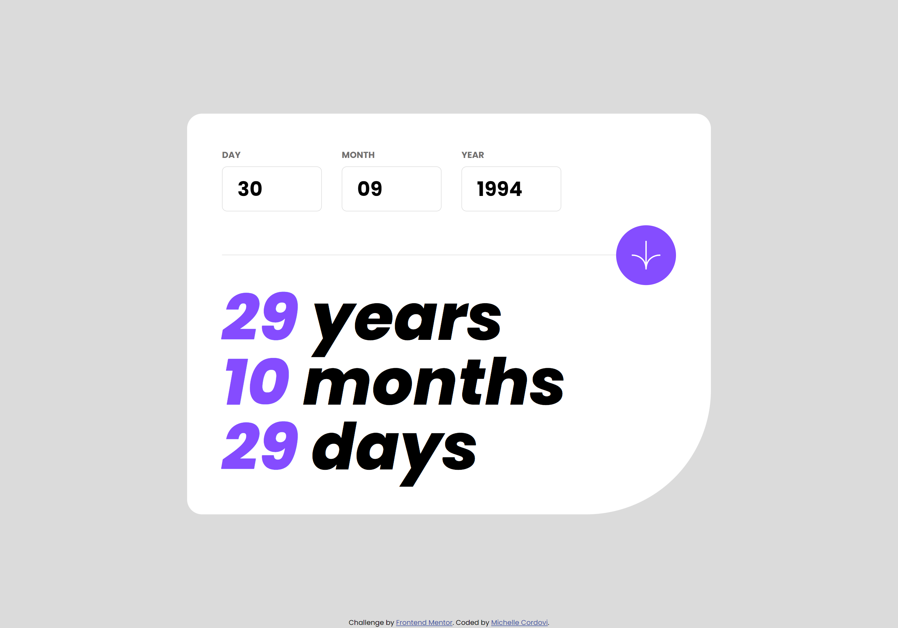
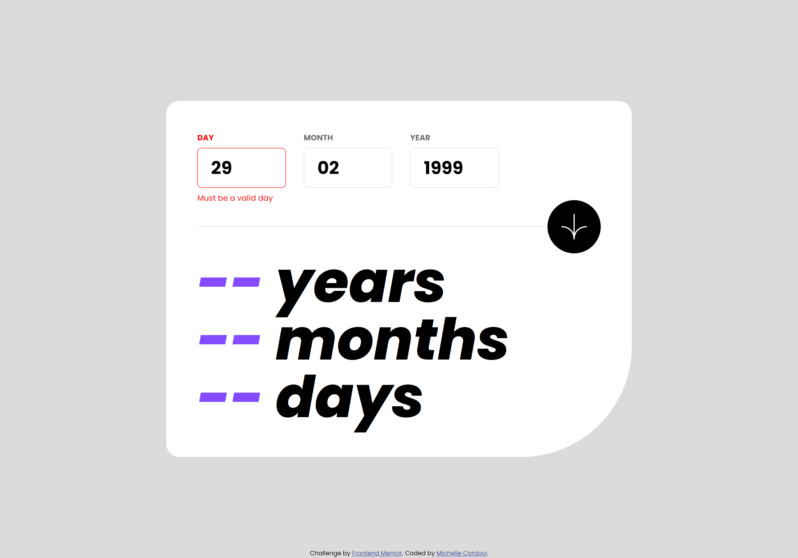
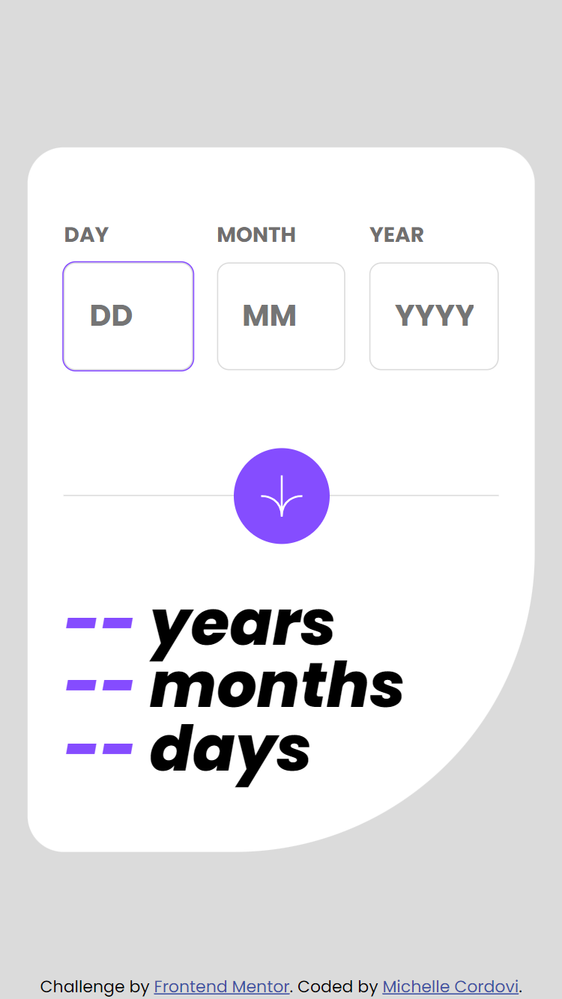

# Frontend Mentor - Age calculator app solution

This is a solution to the [Age calculator app challenge on Frontend Mentor](https://www.frontendmentor.io/challenges/age-calculator-app-dF9DFFpj-Q). Frontend Mentor challenges help you improve your coding skills by building realistic projects. 

## Table of contents

- [Overview](#overview)
  - [The challenge](#the-challenge)
  - [Screenshot](#screenshot)
  - [Links](#links)
- [My process](#my-process)
  - [Built with](#built-with)
  - [What I learned](#what-i-learned)
- [Author](#author)

## Overview

### The challenge

Users should be able to:

- View an age in years, months, and days after submitting a valid date through the form
- Receive validation errors if:
  - Any field is empty when the form is submitted
  - The day number is not between 1-31
  - The month number is not between 1-12
  - The year is in the future
  - The date is invalid e.g. 31/04/1991 (there are 30 days in April)
- View the optimal layout for the interface depending on their device's screen size
- See hover and focus states for all interactive elements on the page

### Screenshot

Desktop view with custom form validation

Mobile view

### Links

- Solution URL: [https://github.com/michellecordovi/AgeCalculator](https://your-solution-url.com)
- Live Site URL: [https://michellecordovi.github.io/AgeCalculator/](https://your-live-site-url.com)

## My process

### Built with

- Semantic HTML5 markup
- CSS3
- Flexbox
- CSS Grid
- Vanilla Javascript

### What I learned

This project was a fantastic learning experience with regards to making the logic for calculating accurate ages but especially good practice for custom form validation. I also had a fun time making sure all aspects of the app were responsive to all screen sizes.

## Author

- Website - [Michelle Cordovi](https://www.linkedin.com/in/michelle-cordovi-dpt-35588683/)
- Frontend Mentor - [@michellecordovi](https://www.frontendmentor.io/profile/michellecordovi)